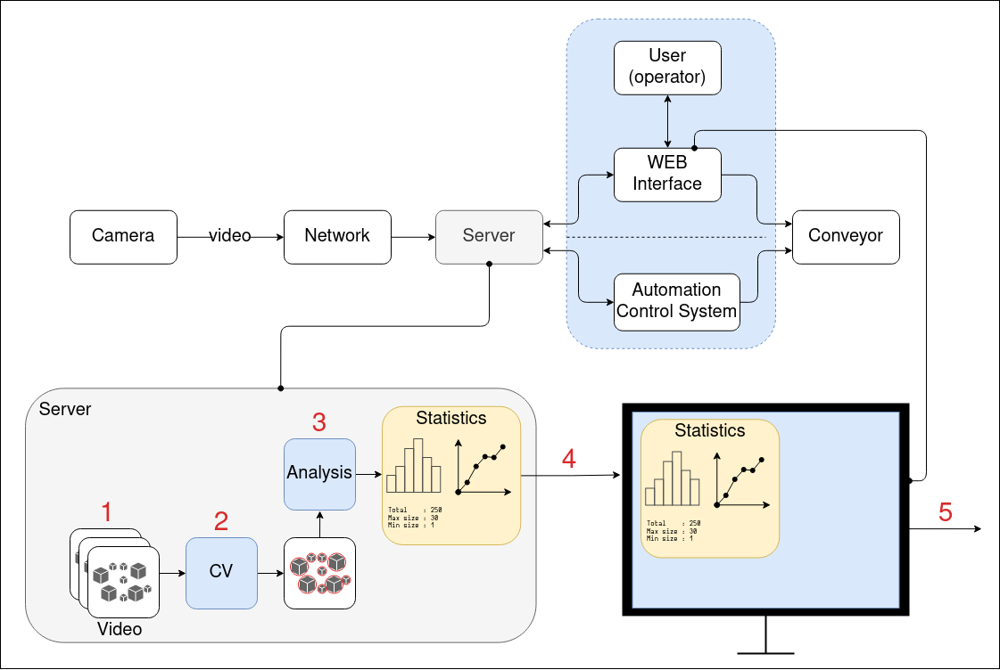

# Introduction

## Purpose of Document

This is a System Requirements Specification document for the coal composition control system in EVRAZ. EVRAZ is a global steel
and mining company and the leading producer of infrastructure steel products. At some point of the production process it must be
decided if the coal has to be ground. This project is intended to build a system that would be able to make this decision or at
least to delegate this task to a production operator along with providing the information which is necessary _and
sufficient_ to decide correctly.

This document describes objectives and goal of the project. Also it describes the functional requirements
 and software architecture which the implementation of the target system is based on.

## Document Conventions

This document uses the following conventions

1. The uppercase words MUST and MUST NOT are reserved exclusively for stating rules which must be followed in order the target
system to be accepted;
2. The uppercase words SHOULD and SHOULD NOT are reserved exclusively for stating suggestions which are desirable but not essential
to follow;

# Overall Description

The product MUST provide a solution to the following problem:

and MUST contain the following steps:

0. A fragment of the conveyor is recorded by a video-camera;
1. The recorded data transfers over the network to the server;
2. Transferred data is being processed by the AI-based algorithm (the main part of the product);
3. The result of the previous step is being processed yet to produce important statistics (histograms, graphs, etc);
4. The data obtained in the previous step is visualized in the Web interface;
5. An operator decides if grinding is necessary.

The following block diagram describes the process:

# Functional Requirements

## High Priority

1. The system MUST be able to detect separate coal pieces in the image;
2. The system MUST be able to calculate the size of detected pieces;
3. The system MUST be able to create a "real-time" statistics: the coal size distribution displayed as a histogram;
4. The system MUST provide a Web interface to monitor the coal composition in real-time:
    - it MUST display the area of the conveyor recorded;
    - it MUST display the results of the object detection algorithm (e.g. by drawing the contour of a coal piece detected);
    - it MUST display the coal size distribution.

## Medium Priority

1. The system SHOULD be accompanied by tests which could be used to validate correct usage on a specific
OS or/and architecture.

## Low Priority

# Non-Functional Requirements

## Arrangement & Organization

1. The project MUST have a remote repository (hereinafter the repo) that MUST contain final code;
2. The work on the project SHOULD be organized with the aim of a task management service (like _Trello_ or others).

## Performance Requirements

1. Latency between the conveyor and the picture the operator sees MUST NOT exceed 10 sec.

## Online user Documentaation and Help

1. Web Interface SHOULD contain tooltips.

## Purchased Components

1. Video cameras (one camera for one conveyor);
2. Transferring infastructure (wires, commutators, switches, routers);
3. Servers.

## Documentation Requirements

Documentation must consist of at least 3 documents:

1. README.md;
2. SRS (this document);
3. User's guide.

### README.md

MUST describe the purpose of the repo and provide the perspective view of the product.

MUST also answer the following question:

- What is the product?
- What is the purpose of the product?
- How to use the product?

## System Requirements Specification

This document. See [Purpose of Document](#purpose-of-document) for details.

## User's Guide

Detailed description of how to work in the Web Interface.

# The Use Case Model
