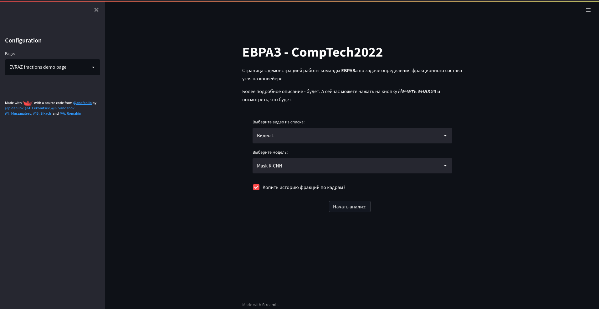
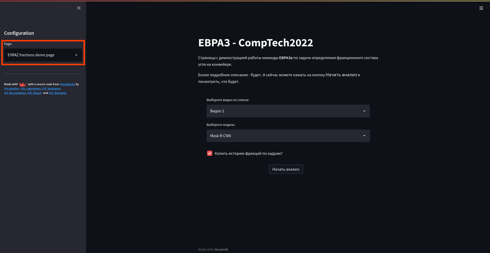
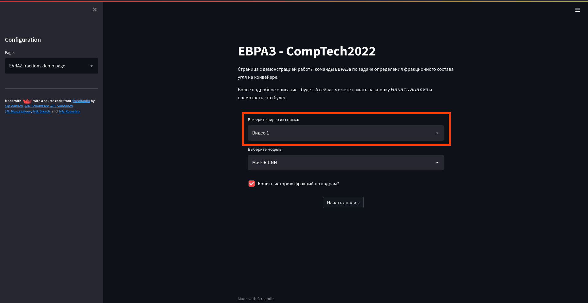
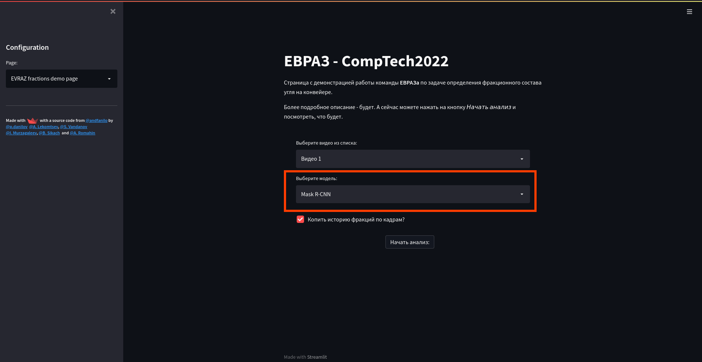
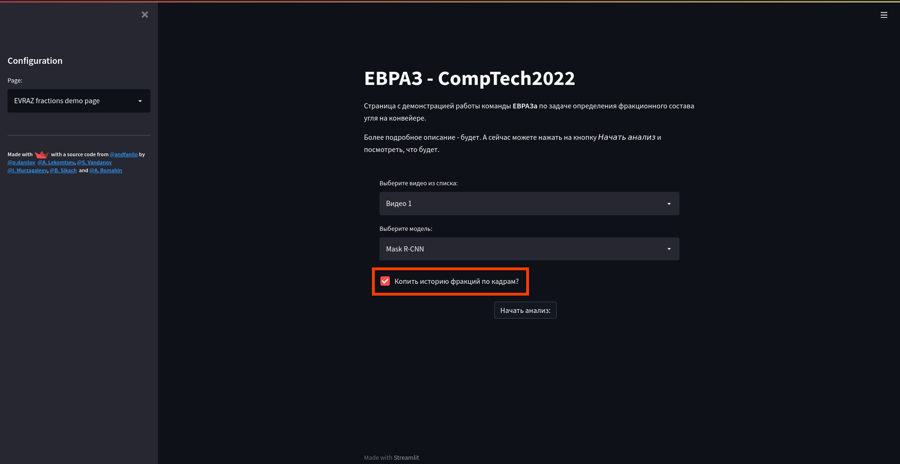
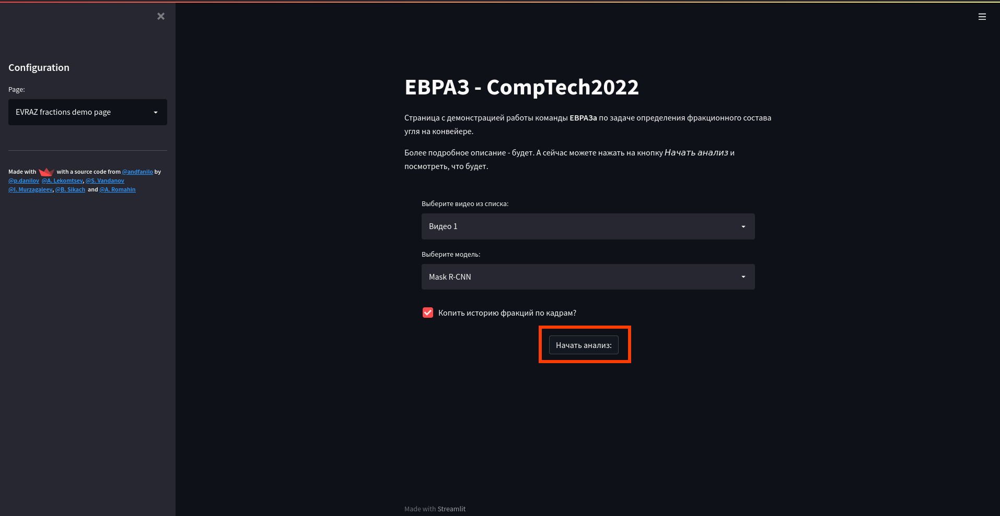
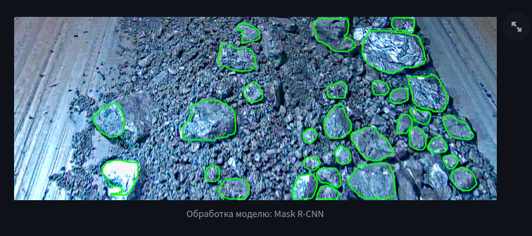
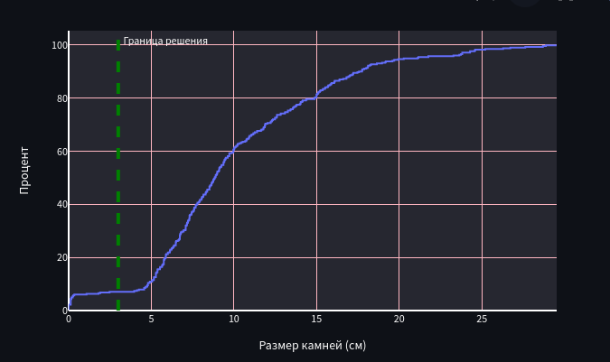

# 1. Introduction

This is a detailed description of a demo interface.

# 2. Getting Started

Provided you've successfully connected to the demo host, you should see the following page:

## 2.1 Page Selection

The `EVRAZ fractions demo page` option in the _page_ combobox must be selected:

## 2.2 Configuration

### 2.2.1 Video Selection

To choose a video to be processed interract with the _video_ combobox:

### 2.2.2 Model Selection

To choose a model to be used in the inference stage interract with the _model_ combobox:

### 2.2.3 Mode Selection

There are two analysis modes available:

- Updating
- Non-updating

_Updating_ mode means that the histogram is being cleared every time a new frame begins.
_Non-updating_ mode means that the histogram is not cleared during the whole video.

To select either mode use the _mode_ checkbox:

## 2.3 Processing

After you've done with the configuration stage you can start video processing by clicking the _start_ button:

After that you should see new 2 subwindows:

- Processed video window
- Histogram window

### 2.3.1 Processed Video Window

### 2.3.2 Histogram

